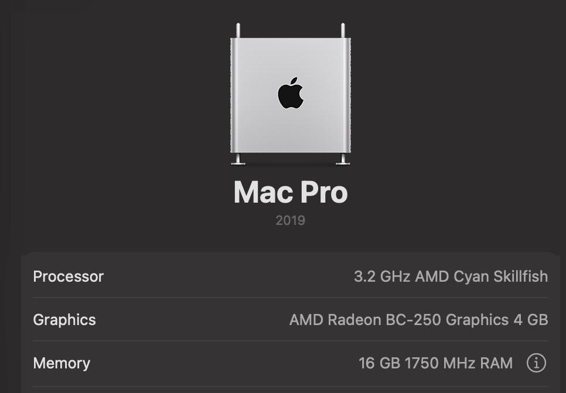
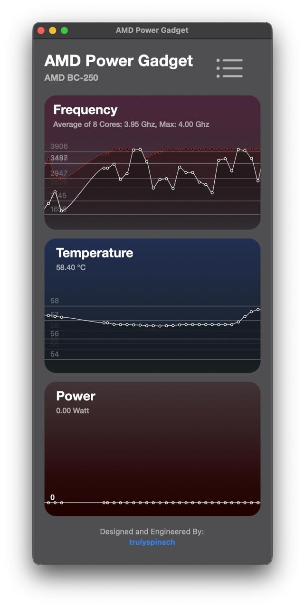

# BC-250 Hackintosh OpenCore

OpenCore EFI for the ASRock BC-250 (AMD Cyan Skillfish: 6-core Zen 2 plus an RDNA GPU, 16 GB GDDR6 shared).
OpenCore 1.0.8 RELEASE, macOS Tahoe 26.7.1, MacPro7,1 SMBIOS.

## Status

| | |
|---|---|
| CPU | 6 cores / 12 threads stock, 8 / 16 with the unlock below. Shows as "AMD Cyan Skillfish" |
| GPU | Metal 3 with [MetalCyan](https://github.com/amethyst8118/MetalCyan). 24 CUs stock, 40 with `bc250cu=40` |
| VRAM | 4 GB (BIOS setting below) |
| Ethernet | Works (RealtekRTL8111) |
| NVMe | Works |
| USB | USB 2.0 ports only. Not mapped yet, XHCI0 has to be off in the BIOS |
| Audio | None. No HDMI/DP audio yet, and the board has no analog codec |
| Video decode | Software only (VCN isn't usable on this chip) |
| Sleep | Not tested |

## Get started

> [!IMPORTANT]
> This EFI is for **macOS Tahoe 26.7.1** with the **MacPro7,1** SMBIOS only. The kernel patches and MetalCyan are
> matched to that exact build. Other macOS versions and other SMBIOS models aren't supported and may not boot.

### BIOS

- **UMA frame buffer size: 4 GB.** With the default 512 MB the GPU runs out of VRAM and the screen freezes green.
- **IOMMU: Disabled.**
- **XHCI0: Disabled.** Until the USB ports are mapped, only the other controller is used. The ports on XHCI0 stop
  working, so plug the keyboard, mouse and USB stick into the USB 2.0 ports.

### SMBIOS

Generate a **MacPro7,1** serial, MLB, UUID and ROM (GenSMBIOS) and put them in `PlatformInfo > Generic`. They're left
empty here.

## Boot-args

The default is just `npci=0x3000`. Add `-MCOff` to boot without GPU acceleration (plain framebuffer), for example
to rule MetalCyan out when something breaks.

Everything else is opt-in and per board. These come from MetalCyan and talk to the SMU directly:

| Boot-arg | Range | |
|---|---|---|
| `bc250cu=40` | | All 40 CUs instead of 24. More heat and power draw |
| `bc250gfxmhz=N` | 350-2000 MHz | GPU clock. Anything above 2000 makes the SMU firmware stop responding, so it's ignored |
| `bc250gfxmv=N` | 700-1100 mV | GPU voltage, used with `bc250gfxmhz`. Can't go more than 50 mV under the stock curve |
| `bc250cpumhz=N` | 3500-4500 MHz | CPU boost clock. Comes with an undervolt worked out from `bc250cpuvmax` |
| `bc250cpuvmax=N` | 950-1325 mV | CPU voltage ceiling (default 1275) |
| `bc250cputemp=N` | 50-100 °C | CPU temperature limit (default 90 with `bc250cpumhz`) |
| `bc250gputemp=N` | 50-100 °C | GPU temperature where the forced GPU clock is let go (default 90) |
| `bc250smu=0` | | No SMU access at all |

The clocks are applied 60 seconds after boot, so a setting that's too much never stops the machine from booting.
You can always reach the desktop and remove it. If the SMU gets stuck (telemetry frozen, CPU stuck at one clock),
take the setting out and power off for 10 seconds; a restart doesn't reset it.

What this board runs, with 8 cores:

    npci=0x3000 bc250cu=40 bc250gfxmhz=2000 bc250gfxmv=1080 bc250cpumhz=4000 bc250cpuvmax=1300

## 8 cores

The BC-250 has 8 Zen 2 cores with 2 fused off by a core mask the SMU can change. `Drivers/bc250-unlock-driver.efi`
changes it before macOS loads. It's off by default. To turn it on:

1. Enable `bc250-unlock-driver.efi` in `UEFI > Drivers`.
2. In `Kernel > Patch`, change the four `algrey | Force cpuid_cores_per_package` patches from 6 to 8 cores: the
   second byte of `Replace` goes from `06` to `08` (`B8 06` / `BA 06` become `B8 08` / `BA 08`).

On a cold boot the driver unlocks the cores and warm-resets once, so you'll see one extra POST. After that every boot,
cold or warm, comes up with 8 cores / 16 threads. A board whose core mask isn't the stock one is left alone. The
driver also writes rw-r-r-0644's SMU firmware patches on every boot. To go back to 6, disable the driver, set the
patches back to `06` and power off once.

The driver is [Hexxeh/bc250-efi-core-unlock](https://github.com/Hexxeh/bc250-efi-core-unlock) built as an OpenCore
driver. Source patch and build steps are in `src/bc250-unlock-driver`.

## What's in it

- **Kexts:** Lilu, RestrictEvents (CPU name), VirtualSMC, AMDRyzenCPUPowerManagement + SMCAMDProcessor, NVMeFix,
  AppleMCEReporterDisabler, RealtekRTL8111, USBToolBox + UTBDefault, MetalCyan.
- **Kernel patches:** AMD_Vanilla, with the 26.4+ fixes from AMD_Vanilla PR
  [#215](https://github.com/AMD-OSX/AMD_Vanilla/pull/215), plus one more for Tahoe. The BC-250 reports CPUID model
  0x47, which Tahoe takes for an Intel Broadwell and starts XCPM on; the `_xcpm_bootstrap` patch forces it off.
- **CPU name:** set with RestrictEvents' `revcpuname` (NVRAM `4D1FDA02-38C7-4A6A-9CC6-4BCCA8B30102`).
- **Drivers:** OpenRuntime, HfsPlus, ResetNvramEntry, bc250-unlock-driver (disabled).

## Known issues

- **No HDMI/DP audio.** Safari and the TV app won't play video without an audio output device. A virtual one
  (BlackHole etc.) works around it.
- **USB isn't mapped.** XHCI0 is off in the BIOS and only the USB 2.0 ports are used.
- **Panic at shutdown/restart.** WindowServer panics while the display goes down (`IOAccelDisplayMachine::
  display_mode_did_change: AMDRadeonAccelerator driver returns false`). The next boot is fine.
- **No GPU recovery.** If the GPU ever hangs, the screen freezes until a reboot (Navi 10's reset hangs this GPU, so it
  is blocked).
- **Sleep** hasn't been tried.

GPU-side details are in the [MetalCyan README](https://github.com/amethyst8118/MetalCyan).

## Credits

Acidanthera (OpenCore, Lilu, VirtualSMC, NVMeFix, RestrictEvents), AMD-OSX (AMD_Vanilla) and laobamac (PR #215),
trulyspinach (SMCAMDProcessor, AMD Power Gadget), USBToolBox, Mieze (RealtekRTL8111), ChefKiss (NootedRed, which
MetalCyan is based on).

BC-250 tooling the core unlock and MetalCyan's SMU code build on:

- [Hexxeh/bc250-efi-core-unlock](https://github.com/Hexxeh/bc250-efi-core-unlock): the unlock driver
- [rw-r-r-0644/bc250-core-unlock](https://github.com/rw-r-r-0644/bc250-core-unlock) and
  [rw-r-r-0644/bc250-smu-unlock](https://github.com/rw-r-r-0644/bc250-smu-unlock): core unlock and SMU firmware patches
- [bc250-collective/bc250_smu_oc](https://github.com/bc250-collective/bc250_smu_oc): SMU mailbox and CPU overclocking
- [duggasco/bc250-40cu-unlock](https://github.com/duggasco/bc250-40cu-unlock): 40 CU unlock

Not responsible for what happens to your board, especially with the overclocking options.
